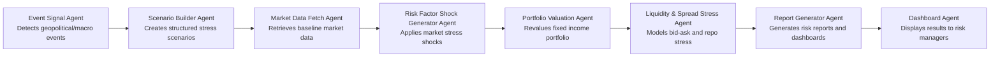
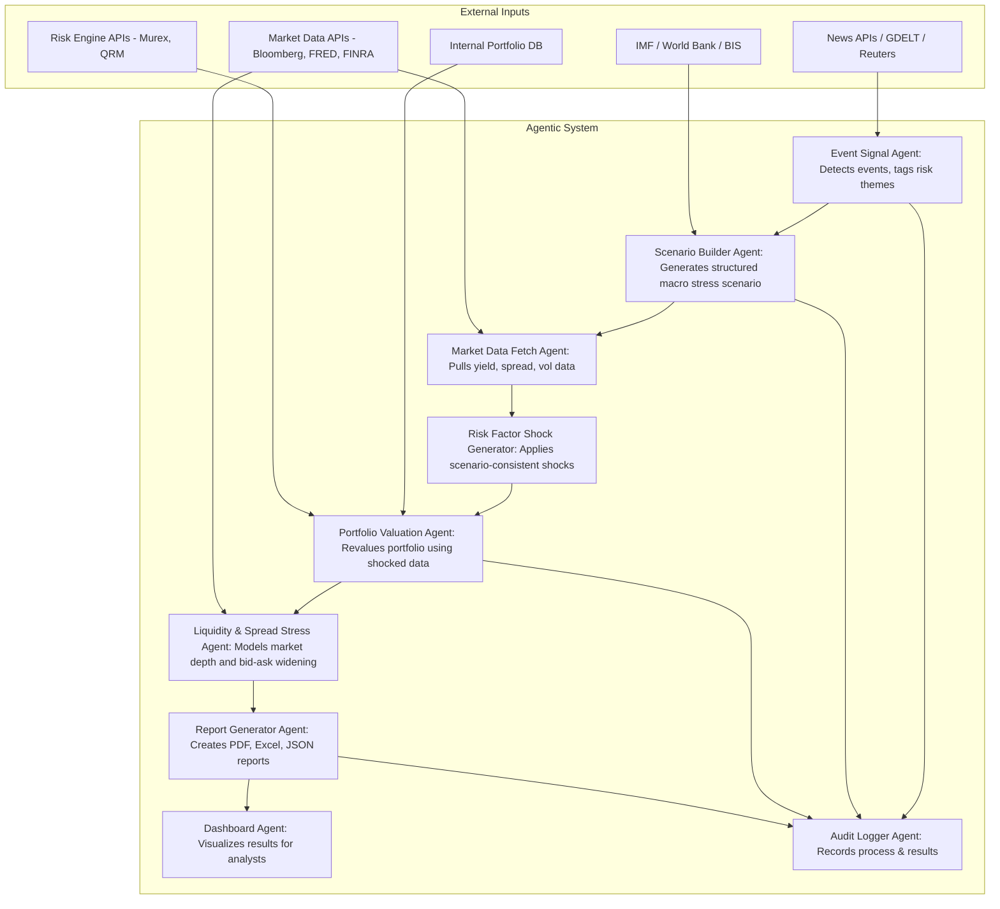
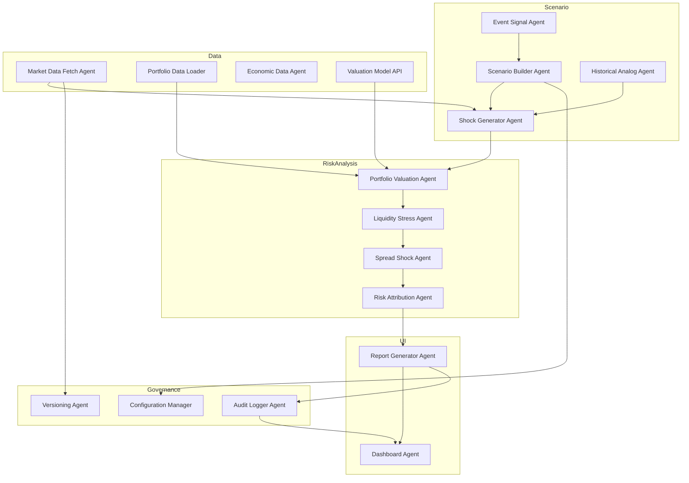

**System Prompt:** Think like a Risk Manager who creates stress test scenarios for fixed income portfolios comprising predominantly AAA bonds (e.g., U.S. Treasuries, agency debt, top-rated sovereigns). Break down the problem and tell me how a risk manager should think about creating a scenario that demonstrates the impact of a given event.

--------------------------------------------------------------------------
**UserPrompt:** US China Geopolitical Tension
--------------------------------------------------------------------------
**Response:**
The goal is to build a scenario around **U.S.–China geopolitical tension** that realistically captures market and credit dynamics, while stressing the portfolio's key risk factors.

---

### **Step-by-Step Thought Process for Scenario Design**

---

## **1. Understand the Portfolio Characteristics**

Before designing the scenario, analyze the **risk profile of the portfolio**:

* **Asset class:** Fixed income (bonds)
* **Rating quality:** AAA (high credit quality, low default risk)
* **Duration/tenor:** Long-duration bonds may be more sensitive to rate changes.
* **Issuer types:** Likely includes:

  * U.S. Treasuries
  * Agency bonds (Fannie Mae, Freddie Mac)
  * Sovereigns (e.g., Germany, Australia)
  * Supranationals (e.g., World Bank)

📌 **Main risks**:

* Interest rate risk
* Liquidity risk
* Currency exposure (if non-USD assets)
* Flight-to-quality dynamic
* Spread widening (if some bonds are quasi-government)

---

## **2. Define the Event Narrative: U.S.–China Geopolitical Tension**

Construct a plausible yet **stressful macro-financial narrative** around the event:

🧾 **Example Scenario Narrative**:

* The U.S. imposes severe export restrictions on advanced semiconductors.
* China retaliates with capital controls and threatens to reduce U.S. Treasury holdings.
* Diplomatic relations deteriorate; trade routes (like Taiwan Strait) face uncertainty.
* Risk of military confrontation in South China Sea or around Taiwan.
* Equity markets plunge; emerging markets suffer capital flight.
* U.S. bond markets are disrupted by concerns over China selling Treasuries.

---

## **3. Translate the Narrative into Risk Factors**

Break down the narrative into **specific risk factor shocks** that affect bond valuation:

| **Risk Factor**    | **Direction of Shock**                                         | **Rationale**                                                   |
| ------------------ | -------------------------------------------------------------- | --------------------------------------------------------------- |
| **Interest Rates** | U.S. Treasury yields spike temporarily, then fall (volatility) | Initial fear of Chinese sell-off, then flight-to-safety buying  |
| **Yield Curve**    | Bear steepening or flattening                                  | Depends on how markets price Fed reaction and inflation         |
| **Credit Spreads** | Widen modestly (even for AAA agencies, supranationals)         | Flight to "pure" risk-free assets (e.g., on-the-run Treasuries) |
| **FX Rates**       | USD strengthens vs CNY, weakens vs JPY/CHF                     | Risk-off currency flows dominate                                |
| **Volatility**     | Spikes in Treasury futures, swaption vols                      | Increased uncertainty and hedging activity                      |
| **Liquidity**      | Bid-ask spreads widen, especially in off-the-run Treasuries    | Market depth decreases due to dealer risk aversion              |

---

## **4. Apply the Shocks Quantitatively**

Use historical analogues or expert judgment to assign stress magnitudes:

| **Risk Factor**           | **Stress Assumption**                                        |
| ------------------------- | ------------------------------------------------------------ |
| 10Y U.S. Treasury Yield   | +50 bps (initial) → −75 bps (flight-to-safety) over 3 months |
| Credit spreads (Agencies) | +20–30 bps widening                                          |
| Supranationals Spread     | +15–25 bps widening                                          |
| USD/CNY                   | +5% depreciation                                             |
| U.S. Treasury Liquidity   | 50% drop in market depth (modeled via bid-ask spreads)       |
| Volatility (Swaptions)    | +40% increase in implied vols                                |

Note: Choose stress horizon (e.g., 1 week, 1 month, 3 months) based on risk type.

---

## **5. Run Portfolio Revaluation**

Feed these shocks into a **risk engine** or pricing model:

* Shift yield curves (OIS, Treasury, swap)
* Reprice bonds using shocked curves and spreads
* Capture MTM (mark-to-market) losses or gains
* Measure VaR increase, P\&L distribution, and liquidity impact

📊 **Key outputs**:

* Portfolio value change
* Duration and convexity impacts
* Spread-attribution loss
* Liquidity-adjusted loss
* Scenario P\&L vs baseline

---

## **6. Supplement with Qualitative Risk Assessment**

Even if credit risk is low, a scenario might reveal **second-order risks**:

* Counterparty exposure (repo desks, funding desks)
* Collateral stress in margin calls
* Market dislocations (e.g., dislocation between on-the-run/off-the-run bonds)
* Central bank response uncertainty

---

## **7. Report and Communicate**

Summarize the impact to stakeholders:

* Scenario name and description
* Key assumptions and magnitudes
* Quantitative results (P\&L, risk metrics)
* Portfolio weaknesses (e.g., duration-heavy or liquidity-trapped)
* Recommended mitigants (e.g., hedging, shortening duration, improving liquidity buffers)

---

## Recap: Risk Manager’s Checklist

| Step                         | Action                                                   |
| ---------------------------- | -------------------------------------------------------- |
| 1. Know Your Portfolio       | Ratings, duration, issuer type                           |
| 2. Define Event Narrative    | Geopolitical event with economic transmission mechanisms |
| 3. Identify Key Risk Factors | Interest rates, spreads, liquidity, FX, volatility       |
| 4. Quantify the Shocks       | Use historical analogues or judgment                     |
| 5. Run Scenario Analysis     | Portfolio revaluation, liquidity stress, P\&L            |
| 6. Evaluate Broader Risks    | Operational, funding, concentration                      |
| 7. Communicate & Mitigate    | Stress test results + action plan                        |

---
--------------------------------------------------------------------------
**User Prompt**: Produce a report output
--------------------------------------------------------------------------

Below is a **sample stress test report output** for a **fixed income portfolio predominantly composed of AAA-rated bonds**, under the scenario of **U.S.–China Geopolitical Tension**. This is written in a professional risk management format that would typically be used internally within a large bank.

---

# **Stress Test Report: U.S.–China Geopolitical Tension Scenario**

**Prepared by:** Risk Management
**Date:** 2025-06-04
**Portfolio:** Fixed Income – AAA-Rated Securities
**Stress Horizon:** 3 Months
**Risk Type Focus:** Interest Rate Risk, Spread Risk, Liquidity Risk, Market Volatility

---

## **1. Scenario Summary**

**Event:** Escalation of geopolitical tensions between the U.S. and China.
**Trigger:** U.S. imposes severe semiconductor export restrictions. China retaliates via capital controls and signals intent to reduce holdings of U.S. Treasuries. Heightened risk of confrontation in the Taiwan Strait.

**Economic Impact Summary:**

* Equity markets decline globally.
* EM currencies and bonds sell off.
* Flight to quality drives volatility in core fixed income markets.
* Market liquidity in U.S. Treasury market deteriorates due to risk aversion and sell-side balance sheet constraints.

---

## **2. Key Assumptions & Market Shock Inputs**

| **Risk Factor**              | **Base Level** | **Stressed Level** | **Shock Magnitude** | **Rationale**                      |
| ---------------------------- | -------------- | ------------------ | ------------------- | ---------------------------------- |
| 10Y U.S. Treasury Yield      | 4.00%          | 3.25%              | -75 bps             | Flight to safety                   |
| 2Y U.S. Treasury Yield       | 4.30%          | 4.00%              | -30 bps             | Short rates fall moderately        |
| Agency MBS Spread            | 60 bps         | 90 bps             | +30 bps             | Spread widening on liquidity fears |
| Supranational Bond Spread    | 40 bps         | 65 bps             | +25 bps             | Risk-off environment               |
| Bid-Ask Spread (Off-the-run) | 2 bps          | 6 bps              | +200%               | Reduced liquidity                  |
| USD/CNY                      | 7.10           | 7.45               | +4.9%               | CNY depreciation                   |
| Implied Vol (10Y Swaption)   | 60 bps         | 85 bps             | +42%                | Hedge demand spikes volatility     |

---

## **3. Quantitative Impact Analysis**

### Portfolio Metrics

| **Metric**                       | **Base Case** | **Stressed Case** | **Change**       |
| -------------------------------- | ------------- | ----------------- | ---------------- |
| Portfolio Market Value (\$MM)    | 1,000.0       | 980.3             | -1.97%           |
| Duration (Mod)                   | 6.5           | 6.7               | ↑ 0.2            |
| Spread P\&L Impact (\$MM)        | —             | -7.4              | (Agency + Supra) |
| Interest Rate P\&L Impact (\$MM) | —             | +15.2             | Rally in UST     |
| Net P\&L Impact (\$MM)           | —             | **+7.8**          | Positive total   |
| Liquidity Buffer (HQLA) (%)      | 28%           | 25%               | ↓ -3 pts         |
| VaR (1-month, 99%)               | \$5.2MM       | \$7.9MM           | ↑ 52%            |

---

## **4. Key Observations**

* **Positive overall impact** due to strong Treasury rally outweighing modest spread widening in agency and supranational bonds.
* **Portfolio duration increases slightly**, increasing future rate sensitivity.
* **Bid-ask spreads widen sharply**, affecting execution and liquidity management, especially in off-the-run bonds.
* **Increased VaR** driven by higher volatility and increased spread uncertainty.
* Liquidity coverage slightly reduced but remains above internal thresholds.

---

## **5. Risk Management Recommendations**

| **Action**                               | **Priority** | **Rationale**                                          |
| ---------------------------------------- | ------------ | ------------------------------------------------------ |
| Increase cash buffer or HQLA             | High         | Protect against liquidity risk from market dysfunction |
| Reduce duration in non-Treasury assets   | Medium       | Minimize spread volatility exposure                    |
| Monitor central bank policy closely      | Medium       | Unexpected tightening/loosening could alter rate path  |
| Stress test reverse scenario             | Low          | If tensions de-escalate, risk of rates re-normalizing  |
| Increase trade monitoring in TBA markets | Medium       | Agency MBS volatility expected to persist              |

---

## 📌 **6. Conclusion**

This stress test reveals that even high-quality portfolios are **not immune to geopolitical events**, primarily through **spread and liquidity channels**. However, due to the flight-to-quality nature of AAA assets, this portfolio experiences a **net gain** under the modeled scenario.

Ongoing monitoring of **China’s U.S. Treasury holdings**, **market liquidity metrics**, and **central bank signaling** will be critical to proactively manage this risk.

---
----------------------------------------------------------------------------------------------------------------------------------------------------
**User Prompt**: Assuming the availability of task-specific agents and APIs for data access in relevant sources, design an agentic workflow to implement this process. List and describe the task agents, skills, APIs and data sources you will use to implement the workflow.
----------------------------------------------------------------------------------------------------------------------------------------------------
**Response**:

Designing an **agentic workflow** to implement a stress testing process for a **AAA-rated fixed income portfolio under geopolitical stress** (e.g., U.S.–China tensions) involves orchestrating a set of intelligent agents that perform specific tasks, collaborate via APIs, and pull data from structured and unstructured sources.

Here’s a structured agentic system design with modular **Task Agents**, their **skills**, the **APIs/data sources** they use, and how they interact.

---

# 🧠 **Agentic Workflow for Scenario-Based Stress Testing**

---

## 🏗️ **1. Architecture Overview**

```text
[Event Signal Agent]
        ↓
[Scenario Builder Agent]
        ↓
[Market Data Fetch Agent] ←→ [Market APIs, News, Economic Data]
        ↓
[Risk Factor Shock Generator Agent]
        ↓
[Portfolio Valuation Agent] ←→ [Risk Engine API, Portfolio DB]
        ↓
[Liquidity & Spread Stress Agent] ←→ [Liquidity Metrics, BID-ASK APIs]
        ↓
[Report Generator Agent]
        ↓
[Dashboard Agent / Human Risk Manager]
```

---

## 🔁 **2. Task Agents and Responsibilities**

---

### **A. Event Signal Agent**

* **Purpose:** Detect geopolitical or macroeconomic triggers (e.g., U.S.–China tensions).
* **Skills:** NLU for news interpretation, named entity recognition, alert classification.
* **APIs/Data:**

  * News APIs (e.g., Bloomberg, Reuters, GDELT)
  * Social media sentiment APIs (Twitter, Reddit for financial chatter)
  * Internal geopolitical alert systems (if available)
* **Outputs:** Event type, affected regions, sectors, and initial risk tags.

---

### **B. Scenario Builder Agent**

* **Purpose:** Generate narrative-driven macroeconomic and market stress scenarios.
* **Skills:** Scenario synthesis, macroeconomic modeling, NLP summarization.
* **Inputs:** Event tag + historical scenarios + macroeconomic relationships.
* **APIs/Data:**

  * IMF/World Bank databases
  * BIS stress testing libraries
  * Internal scenario libraries (e.g., CCAR/EBA archives)
* **Outputs:** Structured scenario JSON (timeline, macro variables, affected asset classes)

---

### **C. Market Data Fetch Agent**

* **Purpose:** Retrieve baseline market data for yield curves, spreads, volatility.
* **Skills:** API interfacing, time-series construction, currency conversion.
* **APIs/Data:**

  * Bloomberg/Refinitiv APIs (interest rates, swap curves, spreads)
  * FRED / U.S. Treasury Direct / ECB Data Warehouse
  * FINRA ATS data (for MBS/Agency pricing)
* **Outputs:** Baseline risk factor levels (curve, spread, FX, vol)

---

### **D. Risk Factor Shock Generator Agent**

* **Purpose:** Apply shocks to risk factors per scenario.
* **Skills:** Statistical calibration (e.g., percentile-based, regression), shock simulation.
* **Inputs:** Scenario JSON + Baseline Market Data
* **Outputs:** Shocked risk factor curves and vol surfaces

---

### **E. Portfolio Valuation Agent**

* **Purpose:** Revalue the fixed income portfolio under stressed market conditions.
* **Skills:** Bond math (duration, convexity, YTM, Z-spread), pricing models, curve interpolation.
* **APIs/Data:**

  * Risk engine APIs (e.g., QRM, Axioma, Calypso, Murex)
  * Portfolio holdings database (internal system)
* **Outputs:** MTM P\&L, DV01 impact, curve and spread attribution

---

### **F. Liquidity & Spread Stress Agent**

* **Purpose:** Model liquidity shocks, bid-ask widening, and repo market stress.
* **Skills:** Liquidity scoring, execution cost modeling, market microstructure analysis.
* **APIs/Data:**

  * TRACE/FINRA data
  * Bid-ask spread databases (e.g., MarketAxess, Tradeweb APIs)
  * Repo market data (DTCC GCF Repo Index)
* **Outputs:** Liquidity-adjusted valuation loss, execution delay indicators

---

### **G. Report Generator Agent**

* **Purpose:** Generate human-readable and machine-readable reports and dashboards.
* **Skills:** Data summarization, chart/graph rendering, NLG (Natural Language Generation).
* **Inputs:** All upstream outputs (valuation, risk metrics, liquidity stress).
* **Formats:**

  * PDF / HTML report
  * JSON for dashboards
  * Excel for analyst teams

---

### **H. Dashboard Agent (Optional)**

* **Purpose:** Provide a web interface to visualize and interact with stress results.
* **Skills:** API integration, time-series plotting, scenario comparison tools.
* **Tech Stack:** React + Plotly + RESTful APIs

---

## **3. External APIs and Data Sources**

| **Purpose**              | **API / Source**                       |
| ------------------------ | -------------------------------------- |
| Yield Curves             | Bloomberg, Refinitiv, FRED             |
| FX & Interest Rates      | Open Exchange Rates, OANDA             |
| News/Event Triggers      | GDELT, Bloomberg News API, Google News |
| Bond Liquidity Data      | MarketAxess, Tradeweb, TRACE           |
| Repo Market Stress       | DTCC, New York Fed GCF Repo Data       |
| Economic Indicators      | IMF, OECD, World Bank                  |
| Pricing/Valuation Engine | Murex, Calypso, QRM, RiskMetrics       |

---

## **4. Orchestration and Governance**

* **Agent Manager (Orchestrator):** Routes tasks between agents, manages context.
* **Audit Logger Agent:** Logs inputs/outputs for compliance and reproducibility.
* **Human-in-the-loop Triggers:** Alert if output deviation exceeds confidence bounds.

---

## **5. Output Artifacts**

* **Stress Test Report PDF**
* **Excel Pack (by asset, risk factor, issuer)**
* **Dashboard Views** (P\&L waterfall, risk attribution, scenario sliders)
* **Audit Trail (scenario versioning, model parameters)**

---
--------------------------------------------------------------------------
**User Prompt**: mermaid diagram
--------------------------------------------------------------------------



--------------------------------------------------------------------------
**User Prompt**: Draw a mermaid diagram of the agentic architecture
--------------------------------------------------------------------------


----------------------------------------------------------------------------------------------------------------------------------------------------
**User Prompt**:Now expand the architecture to a detailed agentic design, up to a reasonable modular design for recommended implementation
----------------------------------------------------------------------------------------------------------------------------------------------------
**Response:**
Here's an expanded **modular agentic architecture** for implementing a robust, scalable, and auditable **stress testing system for fixed income portfolios**, tailored for financial institutions using agents, APIs, and data orchestration.

---

## 🧠 **Expanded Agentic Architecture for Scenario-Based Stress Testing**

This architecture is modular and adheres to principles of **separation of concerns**, **microservice compatibility**, and **data lineage**—key for regulatory stress testing environments (e.g., CCAR, EBA).

---

### 🧱 **Architecture Overview: Modular Layers**

```
+--------------------+
|  Human Interfaces  |
+--------------------+
| Dashboard UI       |
| Reporting Module   |
+--------------------+

+------------------------+
|     Reporting Layer    |
+------------------------+
| Report Generator Agent |
| Dashboard Agent        |
| Alert Agent            |
+------------------------+

+--------------------------+
|    Risk Analysis Layer   |
+--------------------------+
| Portfolio Valuation Agent|
| Liquidity Stress Agent   |
| Spread Shock Agent       |
| Risk Attribution Agent   |
+--------------------------+

+----------------------------+
|   Scenario Construction    |
+----------------------------+
| Event Signal Agent         |
| Scenario Builder Agent     |
| Shock Generator Agent      |
| Historical Analog Agent    |
+----------------------------+

+--------------------------+
|      Data Layer          |
+--------------------------+
| Market Data Fetch Agent  |
| Portfolio Data Loader    |
| Economic Data Agent      |
| Valuation Model API      |
+--------------------------+

+----------------------+
|   Governance Layer   |
+----------------------+
| Audit Logger Agent   |
| Configuration Manager|
| Versioning Agent     |
+----------------------+
```

---

### 🧩 **Detailed Modular Design by Agent Group**

---

## **1. Scenario Construction Layer**

These agents generate the “what-if” scenarios that seed downstream stress testing.

| Agent                       | Description                                                                                                      | APIs/Data                                               |
| --------------------------- | ---------------------------------------------------------------------------------------------------------------- | ------------------------------------------------------- |
| **Event Signal Agent**      | Uses NLP on news data to detect macro triggers (e.g., "China threatens to sell Treasuries").                     | GDELT, Bloomberg, Reuters, Twitter API                  |
| **Scenario Builder Agent**  | Generates structured scenario JSON (e.g., GDP, inflation, yield shocks) using internal templates + expert logic. | IMF, BIS, internal scenario libraries                   |
| **Shock Generator Agent**   | Translates scenarios into yield curve, FX, spread, and vol shocks using historical and statistical models.       | FRED, swaption vol data, risk factor calibration models |
| **Historical Analog Agent** | Looks up similar past episodes (e.g., 2015 China deval, 2020 COVID) to infer stress magnitudes.                  | Internal market history DB                              |

---

## **2. Data Layer**

Handles acquisition and preprocessing of data needed for scenario calibration and valuation.

| Agent                       | Description                                                     | APIs/Data                            |
| --------------------------- | --------------------------------------------------------------- | ------------------------------------ |
| **Market Data Fetch Agent** | Gets real-time or historical data (rates, vol, spreads).        | Bloomberg, Refinitiv, Tradeweb, FRED |
| **Portfolio Data Loader**   | Pulls and normalizes bond positions, holdings, issuer metadata. | Internal portfolio DB, custodians    |
| **Economic Data Agent**     | Accesses GDP, CPI, unemployment data to feed into macro models. | IMF, World Bank, OECD APIs           |
| **Valuation Model API**     | Bond pricing engine interface (duration, convexity, YTM)        | QRM, Calypso, Murex                  |

---

## **3. Risk Analysis Layer**

Core computation layer for applying stress and quantifying impacts.

| Agent                         | Description                                                      | APIs/Tools                                         |
| ----------------------------- | ---------------------------------------------------------------- | -------------------------------------------------- |
| **Portfolio Valuation Agent** | Marks portfolio to market using shocked yield and spread curves. | Risk Engine API                                    |
| **Liquidity Stress Agent**    | Simulates market depth drop, bid-ask widening, execution delays. | TRACE, repo data, liquidity scoring models         |
| **Spread Shock Agent**        | Applies issuer-specific or sector-specific spread shocks.        | Internal spread models, rating transition matrices |
| **Risk Attribution Agent**    | Breaks down P\&L impact into IR curve, spread, convexity, FX.    | Attribution engine                                 |

---

## **4. Reporting Layer**

Transforms raw outputs into consumable decision-support material.

| Agent                      | Description                                                               |
| -------------------------- | ------------------------------------------------------------------------- |
| **Report Generator Agent** | Generates PDF, Excel, JSON summaries for risk committees.                 |
| **Dashboard Agent**        | Provides scenario-based drill-downs and portfolio views.                  |
| **Alert Agent**            | Triggers emails or Slack alerts for threshold breaches (e.g., VaR limit). |

---

## **5. Governance Layer**

Ensures auditability, configuration management, and version control.

| Agent                           | Description                                                            |
| ------------------------------- | ---------------------------------------------------------------------- |
| **Audit Logger Agent**          | Records input parameters, data snapshots, and stress results.          |
| **Configuration Manager Agent** | Controls scenario templates, curve shock methods, model versions.      |
| **Versioning Agent**            | Maintains versioning of scenarios, market data, and analytics outputs. |

---

### 📈 **Mermaid Diagram: Modular Agentic Architecture**



---

## 🛠️ **Recommended Implementation Notes**

| Component       | Technology Recommendation                                   |
| --------------- | ----------------------------------------------------------- |
| Agent Execution | Python microservices (FastAPI, Celery) or LangChain agents  |
| Data Exchange   | JSON over REST APIs, or gRPC for low-latency                |
| Orchestration   | Apache Airflow or Temporal.io                               |
| Dashboard UI    | Streamlit, Plotly Dash, or React + REST                     |
| Storage         | PostgreSQL (relational), MinIO (file), Neo4j (traceability) |
| Model Hosting   | Dockerized ML models via FastAPI or TorchServe              |

---
